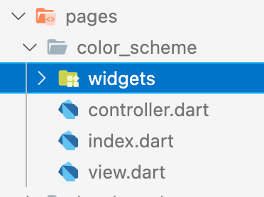
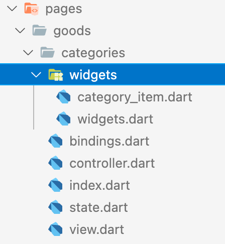

# GetX 项目代码生成工具


© 猫哥

- 微信 ducafecat

- [博客 ducafecat.tech](https://ducafecat.tech/)

- [github](https://github.com/ducafecat)

- [bilibili](https://space.bilibili.com/404904528)


---

这个插件是和 [flutter_ducafecat_news_getx](https://github.com/ducafecat/flutter_ducafecat_news_getx) 配套使用的

- github 仓库地址

https://github.com/ducafecat/flutter_ducafecat_news_getx

## 功能

1. 根据 `x3` 图片自动生成 `x1` `x2` 图片
2. 生成 `图片` `svg` 常量列表 `files.txt`
3. 生成规范目录 `common`
4. 生成 `GetBuilder + GetView` 的代码
5. 生成 `StatefulWidget + GetBuilder + GetView` 的代码
6. 生成 `controller、view、widgets、bindings、state、index ` 完整的代码

---

## 使用说明


> 目录上右键菜单操作

### 1. 根据 x3 图片自动生成 x1 x2 图片

请将你的 `图片`、`Svg` 放到目录

```
assets/images/
assets/svgs/
```

- 准备好你的 `assets/images/3.0x` 图片


- 右键点击菜单 `Assets: Images x1 x2 Generate`


- 成功生成了 `2.0x` 文件夹，和 `1x` 的图片


---

### 2. 生成 `图片` `svg` 常量列表 `files.txt`

点击 `Assets: Images x1 x2 Generate` 同时会生成常量列表文件 `files.txt`

文件位置

```
assets/images/files.txt
assets/svgs/files.txt
```

> 所以你的 `图片` `svg` 要放到指定位置

- 生成 `files.txt` 常量列表


- 如果你把 `svg` 放到 `assets/svgs` 这个目录下，也会生成常量列表


---

### 3. 生成规范目录


自动创建开发目录

```
- common
  - api
    - index.dart
  - i18n
  - models
  - routers
  - services
  - style
  - utils
  - widgets
- pages
  - index.dart
```

---

### 4. 生成 GetBuilder + GetView 的代码




只有 controller、view 两个文件

推荐用这种，简单快速，自带自动释放控制器，GetBuilder 方式对性能也好。

- view

```dart
import 'package:flutter/material.dart';
import 'package:get/get.dart';

import 'index.dart';

class AbcPage extends GetView<AbcController> {
  const AbcPage({Key? key}) : super(key: key);

  Widget _buildView() {
    return Container();
  }

  @override
  Widget build(BuildContext context) {
    return GetBuilder<AbcController>(
      init: AbcController(),
      id: "abc",
      builder: (_) {
        return Scaffold(
          body: SafeArea(
            child: _buildView(),
          ),
        );
      },
    );
  }
}
```

> 采用 `GetBuilder` 手动、布局控制刷新，性能好，推荐这种。
> 注意看这个 `id` 属性，需要全局唯一

代码清单:

- controller

```dart
import 'package:get/get.dart';

class AbcController extends GetxController {
  AbcController();

  _initData() {
    update(["abc"]);
  }

  void onTap() {}

  // @override
  // void onInit() {
  //   super.onInit();
  // }

  @override
  void onReady() {
    super.onReady();
    _initData();
  }

  // @override
  // void onClose() {
  //   super.onClose();
  // }

  // @override
  // void dispose() {
  //   super.dispose();
  // }
}
```

> 常用的生命周期函数也生成了，按需要放开注释
> `update(["abc"]);` 采用这种方式出发 `GetBuilder` 的 `id`属性，进行控制刷新

---

### 5. 生成 StatefulWidget + GetBuilder + GetView 的代码


这种是在 GetBuilder + GetView 的基础上，再加入了 StatefulWidget 包裹，比如你需要 mixin 一些功能的时候需要（AutomaticKeepAliveClientMixin、wantKeepAlive）。

代码清单:

- controller

```dart
import 'package:get/get.dart';

class MyController extends GetxController {
  MyController();

  _initData() {
    update(["my"]);
  }

  void onTap() {}

  // @override
  // void onInit() {
  //   super.onInit();
  // }

  @override
  void onReady() {
    super.onReady();
    _initData();
  }

  // @override
  // void onClose() {
  //   super.onClose();
  // }

  // @override
  // void dispose() {
  //   super.dispose();
  // }
}
```

- view

```dart
import 'package:flutter/material.dart';
import 'package:get/get.dart';

import 'index.dart';

class MyPage extends StatefulWidget {
  const MyPage({Key? key}) : super(key: key);

  @override
  _MyPageState createState() => _MyPageState();
}

class _MyPageState extends State<MyPage>
    with AutomaticKeepAliveClientMixin {
  @override
  bool get wantKeepAlive => true;

  @override
  Widget build(BuildContext context) {
    super.build(context);
    return const _MyViewGetX();
  }
}

class _MyViewGetX extends GetView<MyController> {
  const _MyViewGetX({Key? key}) : super(key: key);

  Widget _buildView() {
    return Container();
  }

  @override
  Widget build(BuildContext context) {
    return GetBuilder<MyController>(
      init: MyController(),
      id: "my",
      builder: (_) {
        return Scaffold(
          body: SafeArea(
            child: _buildView(),
          ),
        );
      },
    );
  }
}

```

> 可以看到 `GetX` 和 `StatefulWidget` 的优雅的结合方式，就是作为组件在 `StatefulWidget.build` 时创建
> 并不是用了 `GetX` 就不要 `StatefulWidget` 了，很多 `Mixin` 还是需要的

---

### 6. 生成 完整的代码


鼠标右键你的视图目录，输入名称生成代码



这种方式，包含了全部的 controller、view、widgets、bindings、state 拆分的很细致

代码清单:

- controller

```dart
import 'package:get/get.dart';

import 'index.dart';

class AccountController extends GetxController {
  AccountController();

  final state = AccountState();

  // tap
  void handleTap(int index) {
    Get.snackbar(
      "标题",
      "消息",
    );
  }

  /// 在 widget 内存中分配后立即调用。
  @override
  void onInit() {
    super.onInit();
  }

  /// 在 onInit() 之后调用 1 帧。这是进入的理想场所
  @override
  void onReady() {
    super.onReady();
  }

  /// 在 [onDelete] 方法之前调用。
  @override
  void onClose() {
    super.onClose();
  }

  /// dispose 释放内存
  @override
  void dispose() {
    super.dispose();
  }
}

```

- view

```dart
import 'package:flutter/material.dart';
import 'package:get/get.dart';

import 'index.dart';
import 'widgets/widgets.dart';

class AccountPage extends GetView<AccountController> {
  const AccountPage({Key? key}) : super(key: key);

  // 内容页
  Widget _buildView() {
    return const HelloWidget();
  }

  @override
  Widget build(BuildContext context) {
    return GetBuilder<AccountController>(
      builder: (_) {
        return Scaffold(
          body: SafeArea(
            child: _buildView(),
          ),
        );
      },
    );
  }
}

```

- bindings

```dart
import 'package:get/get.dart';

import 'controller.dart';

class AccountBinding implements Bindings {
  @override
  void dependencies() {
    Get.lazyPut<AccountController>(() => AccountController());
  }
}

```

- state

```dart
import 'package:get/get.dart';

class AccountState {
  // title
  final _title = "".obs;
  set title(value) => _title.value = value;
  get title => _title.value;
}

```

- index

```dart
library account;

export './state.dart';
export './controller.dart';
export './bindings.dart';
export './view.dart';

```

- widgets/hello.dart

```dart
import 'package:flutter/material.dart';
import 'package:get/get.dart';

import '../index.dart';

/// hello
class HelloWidget extends GetView<AccountController> {
  const HelloWidget({Key? key}) : super(key: key);

  @override
  Widget build(BuildContext context) {
    return Center(
      child: Obx(() => Text(controller.state.title)),
    );
  }
}
```

- widgets/widgets.dart

```dart
library widgets;

export './hello.dart';

```

---

end

大家可以自己动手体验下~

---

© 猫哥

- 微信 ducafecat

- [博客 ducafecat.tech](https://ducafecat.tech/)

- [github](https://github.com/ducafecat)

- [bilibili](https://space.bilibili.com/404904528)


