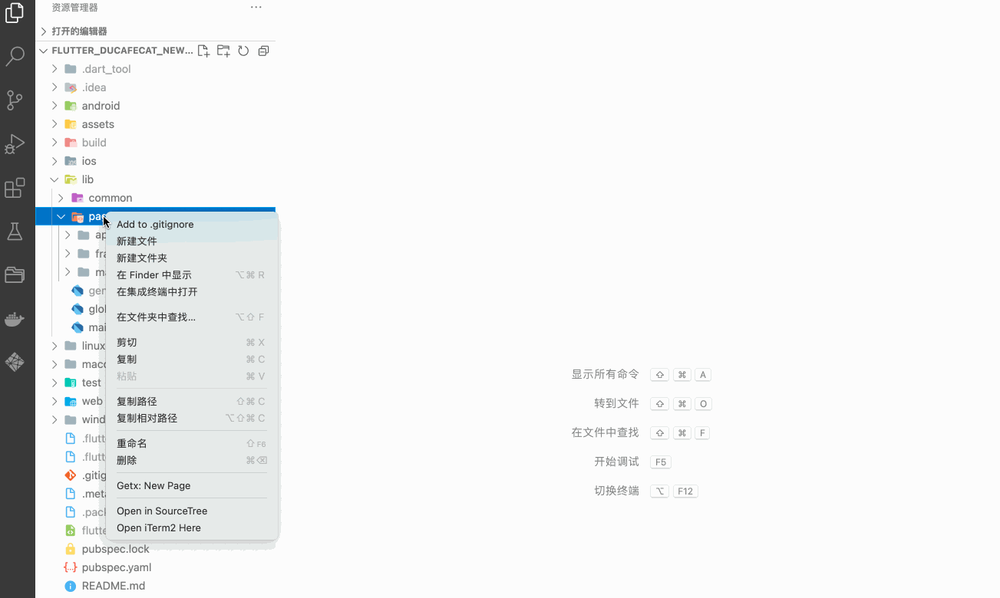

# getx-template

这个插件是和 [flutter_ducafecat_news_getx](https://github.com/ducafecat/flutter_ducafecat_news_getx) 配套使用的

https://github.com/ducafecat/flutter_ducafecat_news_getx

## 功能

- 右键目录生成代码

## 使用说明

### 鼠标右键你的视图目录，输入名称生成代码

